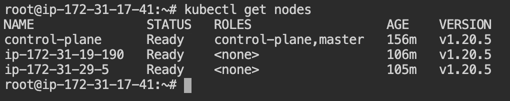
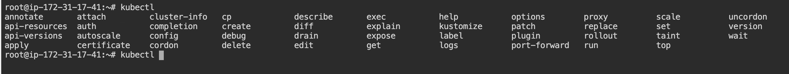

# Kubernetes cluster setup

Documentation for bootstrapping a secure kubernetes cluster.

## Pre-requisites

- Docker needs to be installed.
- Kubernetes needs to be installed.
- You should be logged in as a root user in the master and the worker nodes. \
Run command `sudo su -` on both the worker and the master nodes.

## Setting up the control plane and the workers

- Run command `kubeadm init --node-name control-plane` to register the master node as the *Kubernetes control plane*.
- Create the kubeconfig file for kubectl so that kubectl has the information of the cluster.
```bash
mkdir -p $HOME/.kube
sudo cp -i /etc/kubernetes/admin.conf $HOME/.kube/config
sudo chown $(id -u):$(id -g) $HOME/.kube/config
```
- Alternatively, if you are the root user, you can run the command
`export KUBECONFIG=/etc/kubernetes/admin.conf` to register the control-plane.  
- You can join any number of worker nodes by running the following on each as root \
`kubeadm join 172.31.17.41:6443 --token <token> --discovery -token-ca-cert-hash <certificate>`.
If you need to give a specific name to the worker nodes run the command \
`kubeadm join 172.31.17.41:6443 --token <token> --discovery -token-ca-cert-hash <certificate> --node-name worker2`. If the node name is not given explicitly then it will take the name of the host by default.

- To check whether the nodes and the control-plane is functional run the command \
`kubectl get nodes`


- Next install a network. Run command \
`kubectl apply -f https://docs.projectcalico.org/manifests/calico.yaml`. The status of the nodes should change to `READY`.



- Optionally if you want to enable the auto complete option for kubectl run the command \
```bash
echo 'source <(kubectl completion bash)' >>~/.bashrc
source ~/.bashrc
```
Run the command `kubectl` and press tab to see the auto completion options are being shown or not.


