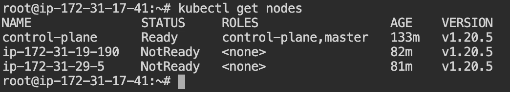
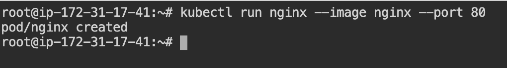
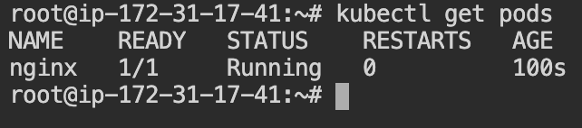
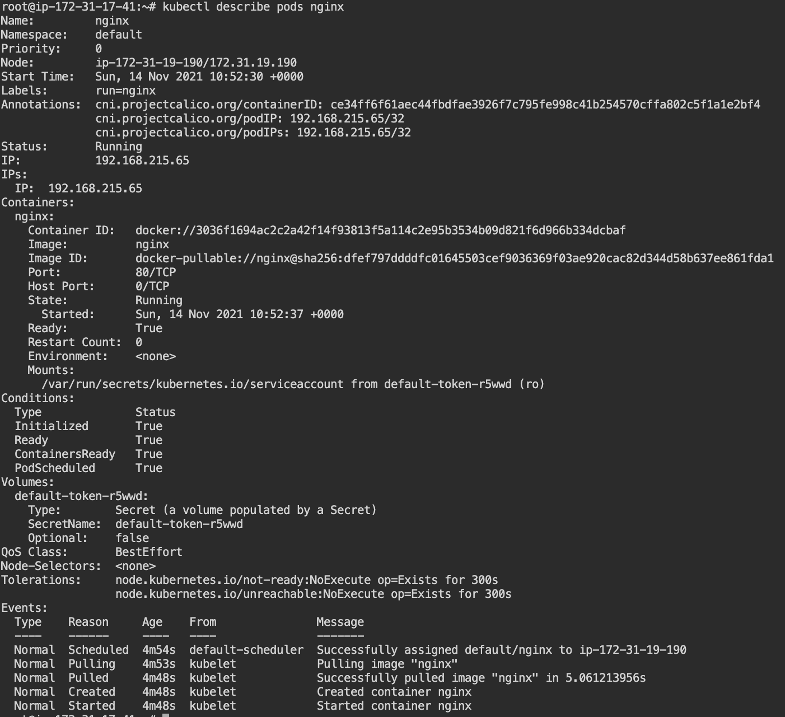

# Kubernetes cluster setup

Documentation for bootstrapping a secure kubernetes cluster.

## Pre-requisites

- Docker needs to be installed.
- Kubernetes needs to be installed.
- You should be logged in as a root user in the master and the worker nodes. \
Run command `sudo su -` on both the worker and the master nodes.

## Setting up the control plane and the workers

- Run command `kubeadm init --node-name control-plane` to register the master node as the *Kubernetes control plane*.
- Create the kubeconfig file on master node for kubectl so that kubectl has the information of the cluster.
```bash
mkdir -p $HOME/.kube
sudo cp -i /etc/kubernetes/admin.conf $HOME/.kube/config
sudo chown $(id -u):$(id -g) $HOME/.kube/config
```
- Alternatively, if you are the root user, you can run the command
`export KUBECONFIG=/etc/kubernetes/admin.conf` to register the control-plane.  
- You can join any number of worker nodes by running the following on each as root \
`kubeadm join 172.31.17.41:6443 --token <token> --discovery -token-ca-cert-hash <certificate>`.
If you need to give a specific name to the worker nodes run the command \
`kubeadm join 172.31.17.41:6443 --token <token> --discovery -token-ca-cert-hash <certificate> --node-name worker2`. If the node name is not given explicitly then it will take the name of the host by default.

- To check whether the nodes and the control-plane is functional run the command \
`kubectl get nodes`



- Next install container network interface on master node. Run command \
`kubectl apply -f https://docs.projectcalico.org/manifests/calico.yaml`. The status of the nodes should change to `READY`.


- Optionally if you want to enable the auto complete option for kubectl run the command \
```bash
echo 'source <(kubectl completion bash)' >>~/.bashrc
source ~/.bashrc
```
Run the command `kubectl` and press tab to see the auto completion options are being shown or not.


## Kubectl syntax format

`kubectl <verb/actions> <api-resource type> [resource name] [options / flags]`

actions include `['get', 'create', 'describe', 'edit', 'delete']`

api-resource type include `['nodes', 'pods', 'secrets', 'configmap', 'deployments']`

### Examples

- If I want to get the details of a node then we can run the command 
`kubectl get nodes control-plane -o wide`.
- If I want to get the details of all the nodes we can run the command \
`kubectl get nodes -o wide`.
- Get the api resources that can be managed on kubernetes clusters using kubectl \
`kubectl api-resources`

## What is a pod ?

Kubernetes manages or deploys a application as an `api-resource` called as `pod`. A pod has an ip address, and many kubernetes specific configurations. A pod is actually and essentially an abstraction or encapsulation on top of containers. Kubernetes creates a pod and inside a pod there is a container. There can be multiple containers tightly coupled inside a pod. In short pod can also be called as *work loads*.

## Setting up a pod 

- To create a pod run the command \
`kubectl run nginx --image nginx --port 80` \
The syntax comprises of the `pod` name and the underlying container type which is specified with the option `--image` and the port which needs to be exposed can be mentioned with the option `--port`.



- To check if the pods are created run the command \
`kubectl get pods` \
See if the pod created has the status as `RUNNING`.



- To get details of the pod created run the command \
`kubectl describe pods nginx`



- 