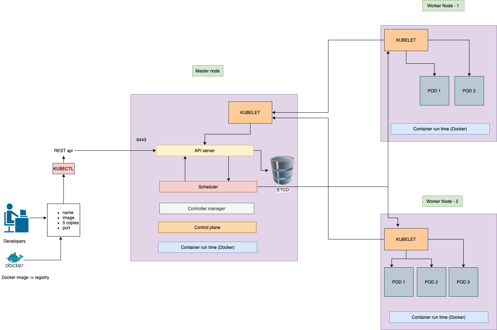

# Kubernetes architecture [A simplified explanation]

## Considerations

We have considered three machines which has

- docker container run time installed
- kubernetes installed in all the machines.
- Make a base check if all the nodes are up and running.

## Components

### Control Plane

- It is also called the `master node`.
- The master node is also caled the `control plane`.
- The control plane is the leader of the clusters.
- The control plane maintains the sanity of the clusters.
- The control plane also maintains the application deployment of the clusters.

### Worker nodes

- The `worker nodes` are controlled by the control plane

### API server

- The api server exposes the kubernetes end point on port `6443` in the control plane machine as rest API.
- The API server also plays an important role in feeding information or metadata of each worker node to the scheduler.
- The API server also get the metadata of each worker node using the application called `kubelet`.

### Kubectl [Kubernetes Control]

- The kubernetes control takes the desired application input and converts it into a rest api request format and submits it to the rest api server.
- The entire interaction from the client to the kubernetes cluster is handled by the `kubectl`.
- We can communicate with the cluster by creating an API request as well but it is more convenient to use the kubectl as it makes things a lot more easier to handle.

The API server receives the request and understands that it has to perform some action so the api server interacts with another kubernetes component which is known as the `scheduler`.

### Scheduler

- The scehduler interact with the worker nodes.
- It checks for resources available for each worker node.
- The scheduler identifies the resources available to create resources on each worker node also known as `pods`.

### Kubelet

- Kubelet is an agent running on all the nodes.
- Kubelet is an application running on each node including the control plane.
- The kubelet interacts with the api server periodically updating the status of each worker node with all the metadata.
- The kubelet updates the state of the worker nodes in the `etcd` database by interacting with the `API server`.
- The kubelet runs the pods based on the the allocation of pods by the `scheduler`.

### ETCD

- The `ETCD` is a database which stores all the metadata of the worker nodes.
- The entire cluster information is also stored in the database.

### Controller manager

The controller manager manages the controllers.

## Note

The kubelet does not directly communicate with the scheduler. It communicates to the kubelet using the API server.
