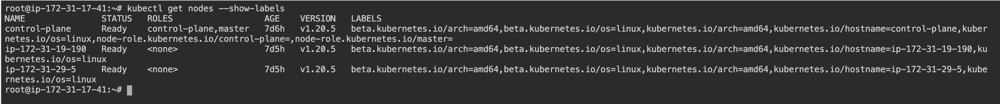
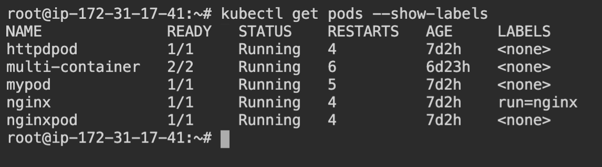
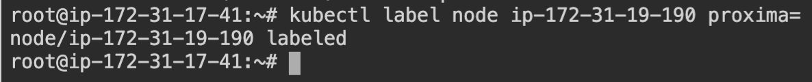
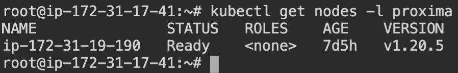
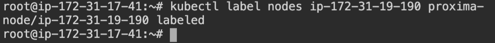
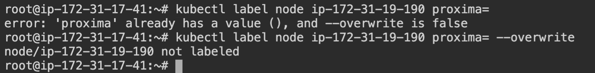

# Labels

Labels are key/value pairs that are attached to objects, such as pods. Labels are intended to be used to specify identifying attributes of objects that are meaningful and relevant to users. Labels can be used to organise and to select subsets of objects. Labels can be attached to objects at creation time and subsequently added and modified at any time. Each object can have a set of key/value labels defined. Each Key must be unique for a given object.

```json
"metadata": {
  "labels": {
    "key1" : "value1",
    "key2" : "value2"
  }
}
```

## Label operations

To associate a label to a resource object here is a list of successive operations on a resource

### Default labels to nodes

To get the default labels for all nodes run the command \
`kubectl get nodes --show-labels`.



### Default labels to pods

To get the default labels for all pods run the command \
`kubectl get pods --show-labels`.




### Applying a label to a node declaratively

`kubectl label node ip-172-31-19-190 proxima=`



### Selecting a node based on label

`kubectl get nodes -l proxima -o wide`



### Remove a label from a node

`kubectl label nodes ip-172-31-19-190 proxima-`



### Overwriting a label

If a label already exist for a node it cannot be overriden until the `overwrite` flag is set

`kubectl label node ip-172-31-19-190 proxima= --overwrite`


