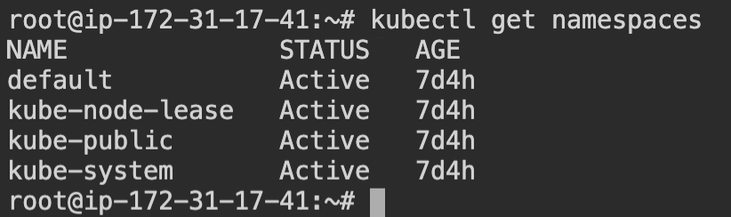
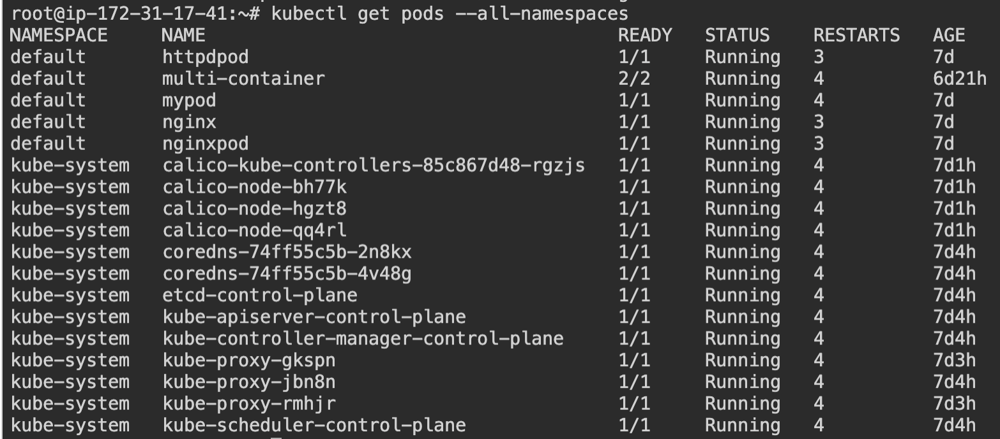
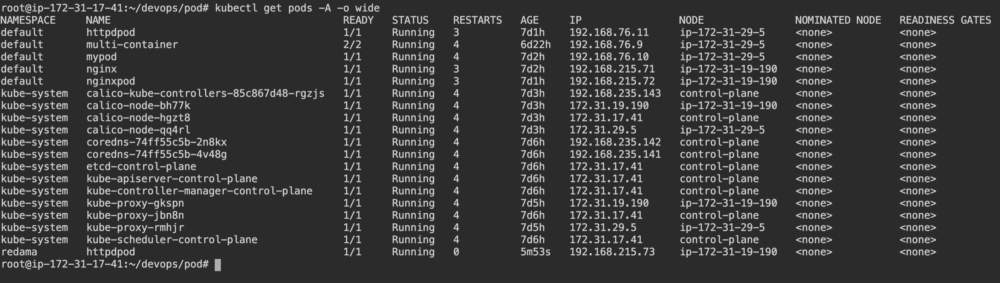
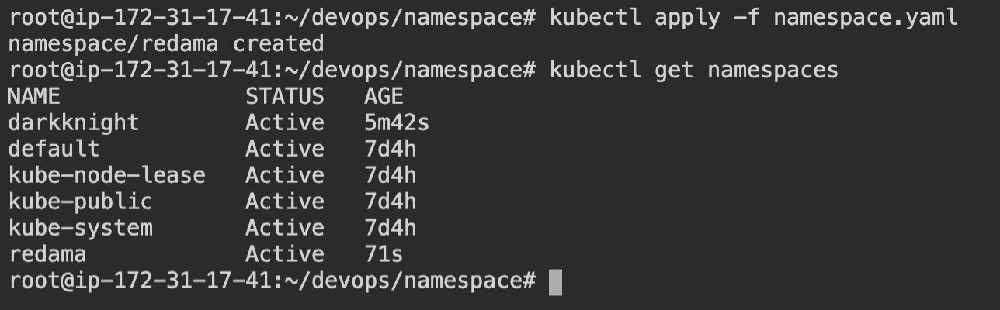

# Namespaces

In Kubernetes, namespaces provides a mechanism for isolating groups of resources within a single cluster. Names of resources need to be unique within a namespace, but not across namespaces. Namespace-based scoping is applicable only for namespaced objects (e.g. Deployments, Services, etc) and not for cluster-wide objects (e.g. StorageClass, Nodes, PersistentVolumes, etc).

Generally we know that every pod should have a unique name. But if multiple namespaces can have pods with the same name.

## Setting up namespaces

### Default namespaces

To get the default namespaces run the command \
`kubectl get namespaces` or `kubectl get ns`

When a pod is deployed it is created in the `default` namespace.



### Get all namespaces

To get all the namespaces run the command \
`kubectl get pods --all-namespaces -o wide` or `kubectl get pods -A -o wide`.



### Get the pods for a specific namespace

To get the pods running in a specific name space run the command \
`kubectl get pods --namespace <namespace>`.



### Creating a custom namespace declaratively

To create a custom namespace declaratively run the command \
`kubectl create namespace <namespace>`

### Create a custom namespace imperatively
To create a custom namespace imperatively create a namespace configuration

```yaml
apiVersion: v1
kind: Namespace
metadata:
 name: redama
```
Then run command `kubectl apply -f <file>.yaml`



### Creating a pod within a particular namespace

To create a pod within a particular namespace use the following configuration

```yaml
apiVersion: v1
kind: Pod
metadata:
 name: httpdpod
 namespace: redama
spec:
 containers:
  - name: mycontainer
    image: httpd
    ports:
    - containerPort: 80
```

After this run `kubectl apply -f <file_name>.yaml`

Run `kubectl get pods` to check whether the pod exist in the default namespace. It should not be present in the default namespace.

Next run `kubectl get pods -A -o wide`


### Creating and allocating a pod declaratively

To create a pod declaratively and allocating a namespace to it run

`kubectl run anotherpod --image nginx --ns <namespace>`.

After this do a `kubectl get pods -A` to check whether the pod has been allocated to the namespaces.

### Delete pods from a namespace

To delete pods from a namespace run the command `kubectl delete namespaces <namespace>`.

If a namespace is deleted all resources associated with a namespace will be removed. 
