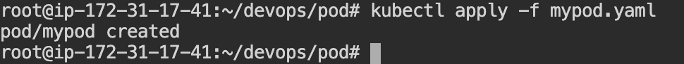
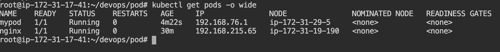
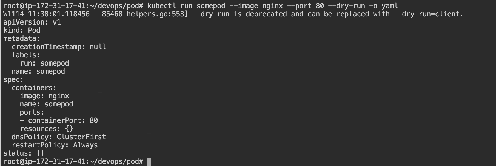
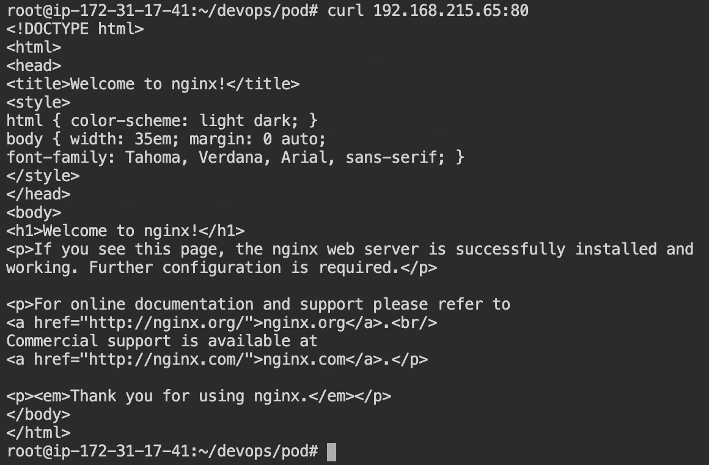
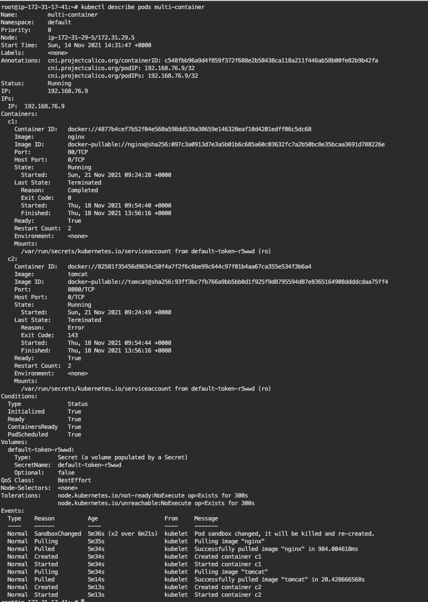

# Pods

## What is a pod ?

Kubernetes manages or deploys a application as an `api-resource` called as `pod`. A pod has an ip address, its own network namespace, and many kubernetes specific configurations. A pod is actually and essentially an abstraction or encapsulation on top of containers. Kubernetes creates a pod and inside a pod there is a container. There can be multiple containers tightly coupled inside a pod. In short pod can also be called as *work loads*.

## Setting up a pod

A pod can be created in 2 ways:

- Imperatively
- Declaratively

### Creating a pod imperatively

- To create a pod run the command \
`kubectl run nginx --image nginx --port 80` \
The syntax comprises of the `pod` name and the underlying container type which is specified with the option `--image` and the port which needs to be exposed can be mentioned with the option `--port`.


- To check if the pods are created run the command \
`kubectl get pods` \
See if the pod created has the status as `RUNNING`.


- To get details of the pod created run the command \
`kubectl describe pods nginx`


### Creating a pod declaratively with a single container

Pods can be created declaratively by creating a `manifest`. Manifest mostly comprises of the pod configurations documented within a `YAML` file. \
To create a pod run the command `kubectl apply -f mypod.yaml`.



To get the details of the created pod run the command \
`kubectl get pods -o wide`



[declaratively creating a single container pod](../pod-configurations/pod_single_container.yaml)

## Creating a pod declaratively with multiple containers

Multi container pod cannot be created in the imperative way. To run multiple containers we need to write a declarative manifest.

[declaratively creating a multiple container pod](../pod-configurations/pod_multiple_container.yaml)

### Pod configuration template

To create a pod configuration template run the command \
`kubectl run somepod --image nginx --port 80 --dry-run -o yaml`



### Note

To access the application of a pod you can do a curl to the ip address of the pod along with the port which is 80 where the server is running. Just run `curl <pod_ip_addres>:80`



## Creating a pod with multiple containers

Multi container pod cannot be created in the imperative way. To run multiple containers we need to write a declarative manifest.

To check if the pod is created run the following

```bash
kubectl get pods
kubectl describe pods <pod-name>
```

To validate check if the two containers are running within the pod



To access the application running on one container in the browser hit the ip-address of the pod and the port of the container.
